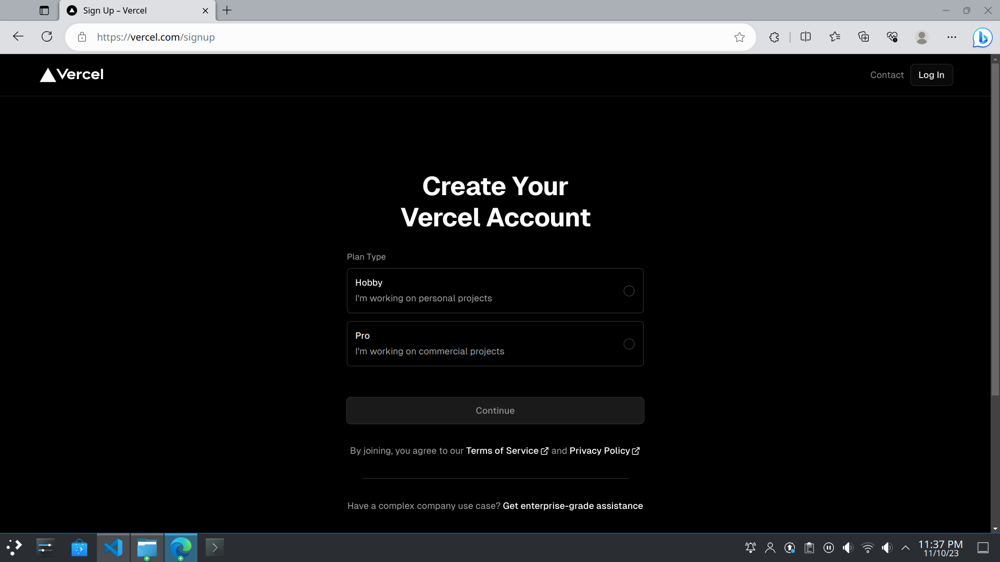
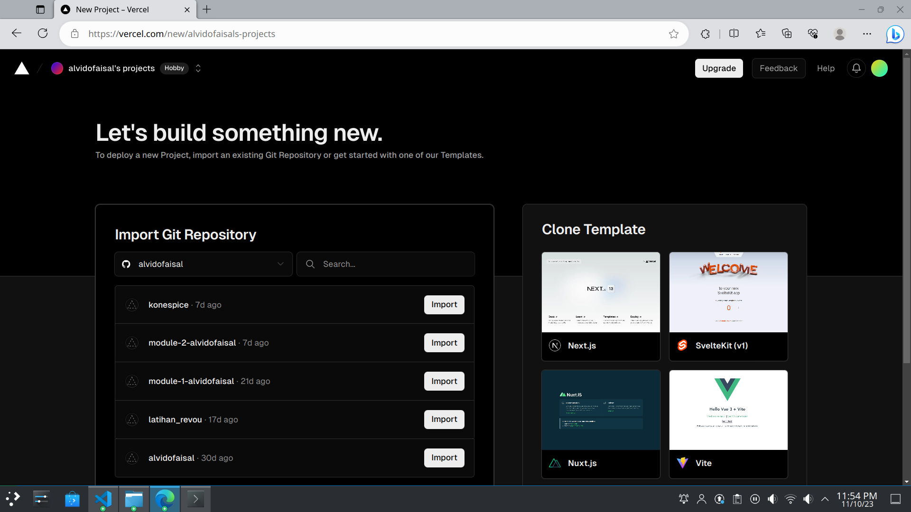
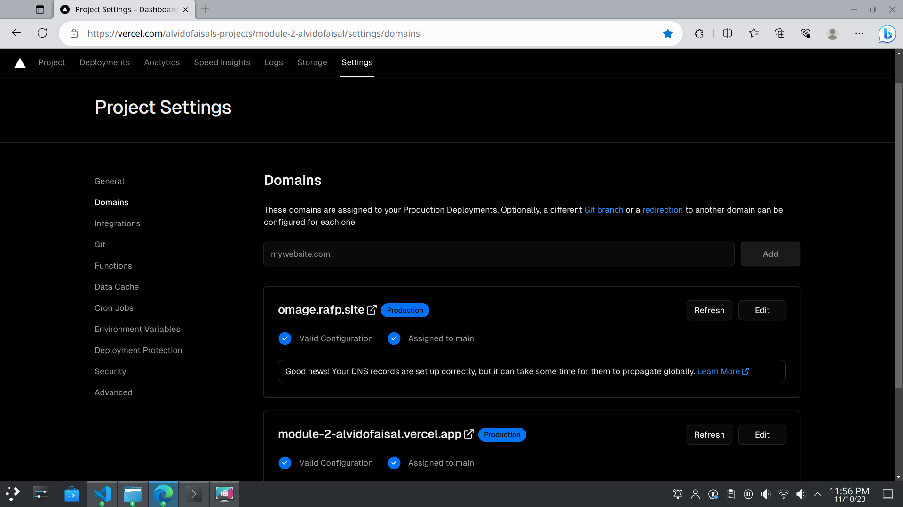
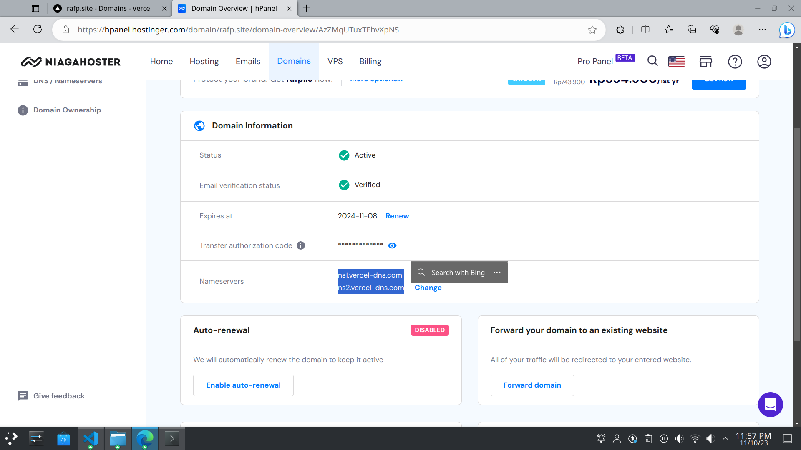

Module 2 Assignment: https://omage.rafp.site

<h1>README: Connecting Vercel to Your GitHub Project with Custom Domain</h1>

<h2>1. Vercel Sign-Up Process & Connecting Vercel to Your GitHub Project</h2>
<h3>Sign-Up for Vercel</h3>

<b>Visit Vercel's Website:</b> Go to Vercel's official website: https://vercel.com/

<b>Create an Account:</b> Click on the "Sign Up" button. You can sign up using your GitHub account for an easier process.

<b>Verification:</b> Verify your email address if prompted.

<h3>Connect Vercel to GitHub</h3>

<b>Integration with GitHub:</b> In the Vercel dashboard, navigate to the "Integrations" section.

<b>Linking GitHub:</b> Find GitHub in the integrations list and select it. Follow the prompts to authorize Vercel to access your GitHub account.

<b>Selecting a Repository:</b> Choose the GitHub repository you want to connect to Vercel.

<h2>2. Auto Deployment on GitHub with Vercel</h2>

<b>Setup Auto-Deployment:</b> Once your GitHub account is linked, Vercel automatically deploys new commits made to your linked repositories.

<b>Configure Build Settings:</b> In the project settings, configure the build settings according to your project's needs.

<b>Push to Deploy:</b> Every time you push changes to the connected branch (usually main or master), Vercel will automatically deploy the new version.

<h2>3. Connecting Custom Domain and DNS using Vercel DNS Nameservers</h2>
<h3>Add Custom Domain to Vercel</h3>

<b>Navigate to Domain Settings:</b> In your Vercel project dashboard, go to the "Settings" tab and then to the "Domains" section.

<b>Add Your Domain:</b> Click on "Add" and enter your custom domain name, rafp.site.

<b>Verify Ownership:</b> Follow the instructions to verify your domain ownership. This typically involves adding a TXT record in your domain registrar's DNS settings.

<h3>Configure DNS with Vercel Nameservers</h3>

<b>Get Vercel DNS Details:</b> Vercel will provide you with its DNS nameservers details.

<b>Update Nameservers:</b> Go to your domain registrar's website, find the DNS settings for your custom site, and replace the current nameservers with the ones provided by Vercel.

<b>Propagation:</b> Wait for the DNS changes to propagate. This may take up to 48 hours.

<b>Final Verification:</b> Once the DNS changes have propagated, go back to Vercel's domain settings and verify that your domain is correctly configured.

<h1>Module 2 - Advanced Assignment</h1>

This is the advanced assignment that I have made for RevoU FSSE Module 2: https://omage.rafp.site

The tasks fulfilled within this assignment:
-  Custom font applied using @font-face: 'Poppins' and 'Almarose'
- Text-shadow applied in "search" section to highlight it from the background image
- List-style applied in navigation inside hamburger button
- Responsive background is applied in the main page (via CSS, toggle between images  following the darkmode) and signup page (with picture + source +   
srcset) method.
- Asymmetrical Grid applied in gallery in main page
- Advanced Form Element (date) applied in signup page, accessed by clicking hamburger button and then sign up .
- Simple animation (spinning) applied in darkmode button
- Simple transition (silde) applied in darkmode button
- Created day and night/dark mode, and made sure the the settings is still saved eventhough the user refreshes the browser.

